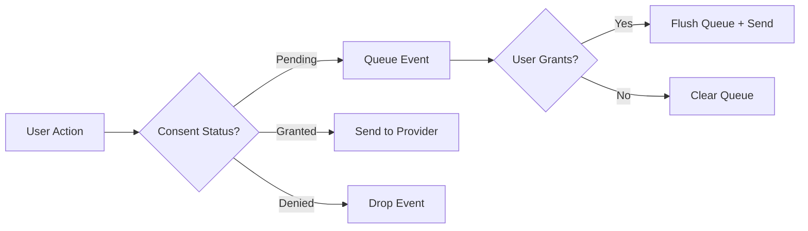

# Consent Management Guide

Trackkit includes a lightweight, privacy-first consent management system that helps you comply with GDPR, CCPA, and other privacy regulations.

## Quick Start

```typescript
import { init, grantConsent, denyConsent, getConsent } from 'trackkit';

// Initialize with explicit consent required (default)
init({
  provider: 'umami',
  siteId: 'your-site-id',
  consent: {
    requireExplicit: true,
    policyVersion: '1.0', // Optional: for version tracking
  },
});

// Check consent status
const consent = getConsent();
if (consent?.status === 'pending') {
  showCookieBanner();
}

// Handle user consent
document.getElementById('accept-cookies')?.addEventListener('click', () => {
  grantConsent();
  hideCookieBanner();
});

document.getElementById('reject-cookies')?.addEventListener('click', () => {
  denyConsent();
  hideCookieBanner();
});
```

## Consent States

### Pending (Default)
- No analytics events are sent to providers
- Events are queued in memory (up to configured limit)
- User hasn't made a consent decision yet
- Essential/necessary tracking is allowed

### Granted
- All analytics tracking is enabled
- Queued events are immediately sent
- Consent choice is persisted for future visits
- New events are sent in real-time

### Denied
- All analytics tracking is disabled
- Queued events are discarded
- No future events will be tracked
- Essential tracking may still be allowed

## Configuration Options

```typescript
interface ConsentOptions {
  /**
   * If true, explicit consent is required before any tracking
   * If false, implicit consent is granted on first user action
   * @default true
   */
  requireExplicit?: boolean;
  
  /**
   * Current privacy policy version
   * If stored version differs, consent is reset to pending
   */
  policyVersion?: string;
  
  /**
   * Disable consent persistence (memory-only)
   * @default false
   */
  disablePersistence?: boolean;
  
  /**
   * Custom localStorage key for consent state
   * @default '__trackkit_consent__'
   */
  storageKey?: string;
}
```

## API Reference

### Core Functions

```typescript
// Get current consent state
const consent = getConsent();
console.log(consent?.status);          // 'pending' | 'granted' | 'denied'
console.log(consent?.timestamp);       // When consent was given
console.log(consent?.method);          // 'explicit' | 'implicit'
console.log(consent?.queuedEvents);    // Number of events waiting
console.log(consent?.droppedEventsDenied); // Events dropped due to denial

// Update consent
grantConsent();  // User accepts analytics
denyConsent();   // User rejects analytics
resetConsent();  // Reset to pending (clears stored consent)

// Listen for consent changes
const unsubscribe = onConsentChange((status, previousStatus) => {
  console.log(`Consent changed from ${previousStatus} to ${status}`);
  
  if (status === 'granted') {
    // Enable additional features
    loadMarketingPixels();
  }
});

// Clean up listener
unsubscribe();
```

## Event Flow



## Implementation Patterns

### Basic Cookie Banner

```typescript
// components/CookieBanner.ts
import { getConsent, grantConsent, denyConsent, onConsentChange } from 'trackkit';

export class CookieBanner {
  private banner: HTMLElement;
  private unsubscribe?: () => void;
  
  constructor() {
    this.banner = document.getElementById('cookie-banner')!;
    this.init();
  }
  
  private init() {
    // Show banner if consent is pending
    const consent = getConsent();
    if (consent?.status === 'pending') {
      this.show();
    }
    
    // Listen for consent changes
    this.unsubscribe = onConsentChange((status) => {
      if (status !== 'pending') {
        this.hide();
      }
    });
    
    // Bind button handlers
    this.banner.querySelector('.accept-all')?.addEventListener('click', () => {
      grantConsent();
    });
    
    this.banner.querySelector('.reject-all')?.addEventListener('click', () => {
      denyConsent();
    });
  }
  
  show() {
    this.banner.style.display = 'block';
  }
  
  hide() {
    this.banner.style.display = 'none';
  }
  
  destroy() {
    this.unsubscribe?.();
  }
}
```

### Implicit Consent

For regions where opt-out is acceptable:

```typescript
init({
  provider: 'umami',
  consent: {
    requireExplicit: false, // Implicit consent on first interaction
  },
});

// First track call will automatically grant consent
track('page_view'); // Consent promoted to 'granted'
```

### Policy Version Management

Track privacy policy updates and re-request consent:

```typescript
const CURRENT_POLICY_VERSION = '2024-01-15';

init({
  provider: 'umami',
  consent: {
    requireExplicit: true,
    policyVersion: CURRENT_POLICY_VERSION,
  },
});

// If user had consented to an older version,
// consent is automatically reset to 'pending'
```

### Conditional Feature Loading

```typescript
// Only load additional analytics tools after consent
onConsentChange((status) => {
  if (status === 'granted') {
    // Load Facebook Pixel
    import('./analytics/facebook').then(fb => fb.init());
    
    // Load Hotjar
    import('./analytics/hotjar').then(hj => hj.init());
    
    // Enable error tracking
    import('./analytics/sentry').then(sentry => sentry.init());
  }
});
```

### Server-Side Rendering (SSR)

```typescript
// server.ts
import { init } from 'trackkit';

// On server, consent is always pending
init({
  provider: 'umami',
  consent: {
    disablePersistence: true, // No localStorage on server
  },
});

// Events are queued in SSR context
track('server_render', { path: request.path });

// client.ts
// On client hydration, stored consent is loaded
// and queued SSR events are processed based on consent
```

## Privacy Compliance

### GDPR Compliance

1. **Explicit Consent**: Default `requireExplicit: true` ensures no tracking without user action
2. **Right to Withdraw**: `denyConsent()` immediately stops all tracking
3. **Data Minimization**: Only essential consent data is stored
4. **Transparency**: Clear consent status and event queuing

```typescript
// GDPR-compliant setup
init({
  consent: {
    requireExplicit: true,
    policyVersion: '2024-01-15',
  },
});

// Provide clear consent UI
const consentUI = `
  <div class="consent-banner">
    <h3>We value your privacy</h3>
    <p>We use analytics to understand how you use our site and improve your experience.</p>
    <button onclick="trackkit.grantConsent()">Accept Analytics</button>
    <button onclick="trackkit.denyConsent()">Reject All</button>
    <a href="/privacy">Privacy Policy</a>
  </div>
`;
```

### CCPA Compliance

```typescript
// CCPA allows opt-out model
init({
  consent: {
    requireExplicit: false, // Implicit consent allowed
  },
});

// Provide opt-out mechanism
function handleDoNotSell() {
  denyConsent();
  showOptOutConfirmation();
}
```

## Debugging

### Check Current State

```typescript
// In browser console
const consent = trackkit.getConsent();
console.log('Consent Status:', consent?.status);
console.log('Queued Events:', consent?.queuedEvents);
console.log('Dropped Events:', consent?.droppedEventsDenied);

// Check what's in localStorage
console.log('Stored:', localStorage.getItem('__trackkit_consent__'));
```

### Monitor Consent Changes

```typescript
// Debug all consent state changes
onConsentChange((status, prev) => {
  console.log(`[Consent] ${prev} → ${status}`);
});
```

### Test Different Scenarios

```typescript
// Test pending state
localStorage.clear();
location.reload();

// Test granted state
trackkit.grantConsent();

// Test denied state
trackkit.denyConsent();

// Test policy version update
localStorage.setItem('__trackkit_consent__', JSON.stringify({
  status: 'granted',
  version: 'old-version',
  timestamp: Date.now(),
}));
location.reload(); // Should reset to pending
```

## Testing

```typescript
import { describe, it, expect } from 'vitest';
import { init, track, grantConsent, getConsent } from 'trackkit';

describe('Analytics with Consent', () => {
  it('queues events while consent is pending', () => {
    init({ consent: { requireExplicit: true } });
    
    track('test_event');
    
    const consent = getConsent();
    expect(consent?.queuedEvents).toBe(1);
  });
  
  it('sends events after consent granted', async () => {
    init({ consent: { requireExplicit: true } });
    
    track('test_event');
    grantConsent();
    
    // Events are flushed asynchronously
    await new Promise(resolve => setTimeout(resolve, 10));
    
    const consent = getConsent();
    expect(consent?.queuedEvents).toBe(0);
  });
});
```

## Migration Guide

### From Google Analytics

```typescript
// Before (Google Analytics)
gtag('consent', 'update', {
  'analytics_storage': 'granted'
});

// After (Trackkit)
grantConsent();
```

### From Segment

```typescript
// Before (Segment)
analytics.load('writeKey', {
  integrations: {
    'Google Analytics': false
  }
});

// After (Trackkit)
init({
  provider: 'umami',
  consent: { requireExplicit: true }
});
// Selectively grant later
```

## Best Practices

1. **Start with Explicit Consent**: Use `requireExplicit: true` for maximum compliance
2. **Version Your Policy**: Track policy updates with `policyVersion`
3. **Provide Clear UI**: Make consent choices obvious and accessible
4. **Test Edge Cases**: Verify behavior with blocked storage, rapid state changes
5. **Monitor Consent**: Log consent changes for audit trails
6. **Handle Errors Gracefully**: Consent system should never break your app

## Common Issues

### Events Not Being Sent

```typescript
// Check consent status
console.log(getConsent());

// Ensure consent is granted
if (getConsent()?.status !== 'granted') {
  console.log('Consent not granted - events are queued or dropped');
}
```

### Consent Not Persisting

```typescript
// Check if localStorage is available
if (!window.localStorage) {
  console.log('localStorage not available');
}

// Check for storage quota errors
try {
  localStorage.setItem('test', 'test');
  localStorage.removeItem('test');
} catch (e) {
  console.log('Storage quota exceeded or blocked');
}
```

### Queue Overflow

```typescript
// Monitor queue size
const diagnostics = getDiagnostics();
console.log('Queue size:', diagnostics.queueSize);
console.log('Queue limit:', diagnostics.queueLimit);

// Increase queue size if needed
init({
  queueSize: 100, // Default is 50
});
```